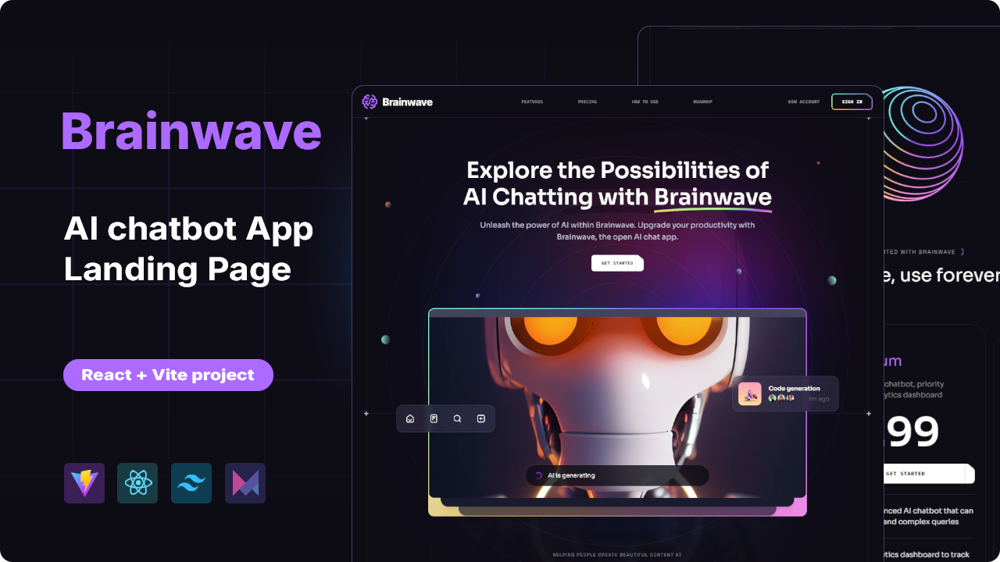

  
   
  

    
    
    
    
  

  <h3 align="center">Brainwave</h3>

  

    A sleek, immersive landing page for the BrainwaveCurve AI chatbot.  
    Designed with dynamic visuals, advanced UI patterns, and an emphasis on motion and clarity.
  

---

## Overview

**Brainwave** is a futuristic product landing experience that showcases the features, vision, and value of an AI chatbot platform. It combines sophisticated motion design with bold UI elements to create an engaging user journey.

## Highlights

- Structured sections including Hero, Services, Benefits, Collaboration, Roadmap, and Pricing  
- Custom parallax animations triggered by mouse movement and scroll depth  
- Advanced layout compositions using Tailwind CSS, such as angled cuts, circular motifs, and geometric overlays  
- Bento grid layout and modern soft glassmorphism for a refined interface  
- Gradient-driven visual language applied consistently across the design

## Tech Stack

- [Vite](https://vitejs.dev)
- [React](https://reactjs.org)
- [Tailwind CSS](https://tailwindcss.com)
- [Framer Motion](https://motion.dev)
- Custom JavaScript-based parallax system

Live Preview [Explore the Brainwave Experience →](https://brainwave-2.web.app)

## Contact

Available for freelance projects and product collaborations.

Email: **[yahialord4315@gmail.com](mailto:yahialord4315@gmail.com)**  
Portfolio: **[https://portfolio25-one.vercel.app](https://portfolio25-one.vercel.app)**

---

## License

MIT License © 2025 Yahia Badr
