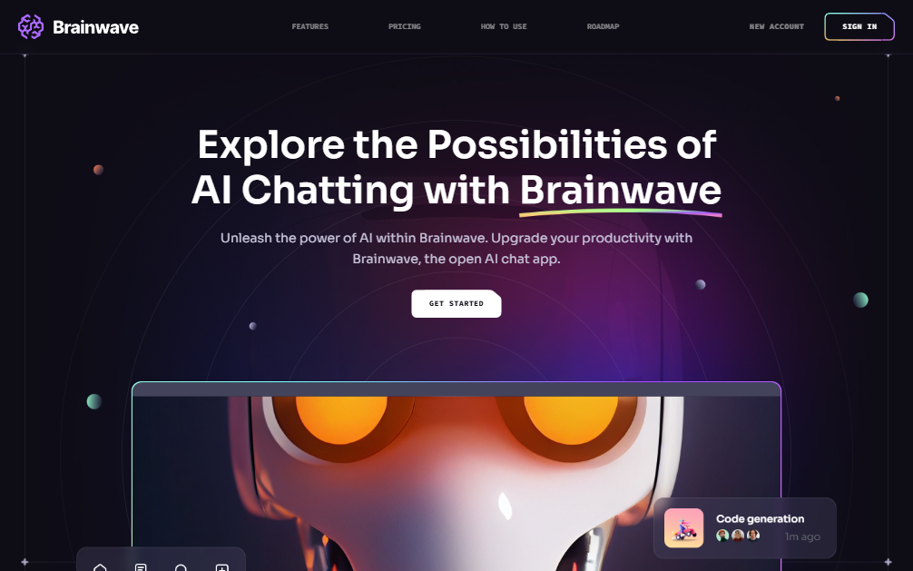

# 🧠 Brainwave

A sleek and futuristic landing page for an AI chatbot – **BrainwaveCurve**.  
It highlights the potential, benefits, and roadmap of the product using bold visuals and immersive animations.

## ✨ Highlights

- 🎯 Beautiful sections: Hero, Services, Features, How to Use, Roadmap, Pricing, Header, Footer
- 🌀 Parallax animations triggered by mouse movement and scroll
- 🧩 Complex UI geometry using Tailwind CSS (circular features, grid lines, angled sections)
- 📐 Modern design trends including bento grids and soft glassmorphism
- 🎨 Stylish gradients applied to cards, buttons, and sections

## 🛠️ Tech Stack

- [Vite](https://vitejs.dev/)
- [React](https://reactjs.org/)
- [Tailwind CSS](https://tailwindcss.com/)
- [GSAP](https://gsap.com/)
- Custom parallax logic (mouse + scroll)

## 📸 Preview

  
🔗 [Live Demo](https://brainwave-2.web.app/)

## 🧑‍💻 Let's Work Together

I’m open for custom projects and freelance work!

📩 Reach me at **[yahialord4315@gmail.com](mailto:yahialord4315@gmail.com)**  
or check out my **[portfolio](https://portfolio25-one.vercel.app/)**.

## 📄 License
MIT License © 2025 Yahia Badr
